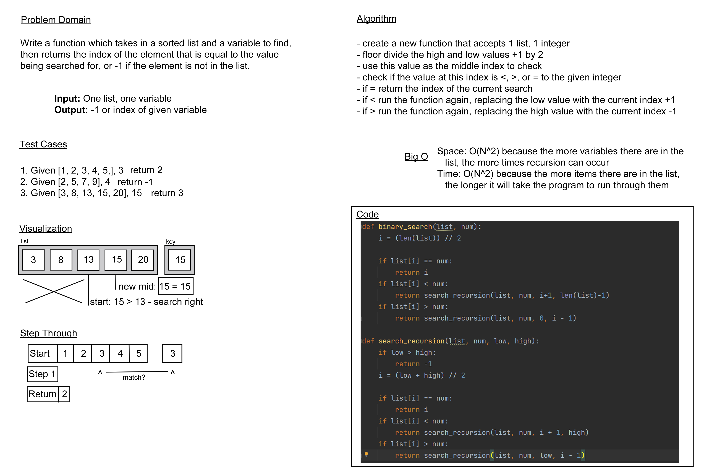

# Challenge 03: Use Binary Search to Find a Value

**Problem Domain:** Write a function which takes in a sorted list and a variable to find, then returns the index of the element that is equal to the value being searched for, or -1 if the element is not in the list.

## Whiteboard Process

## Approach and Efficiency
