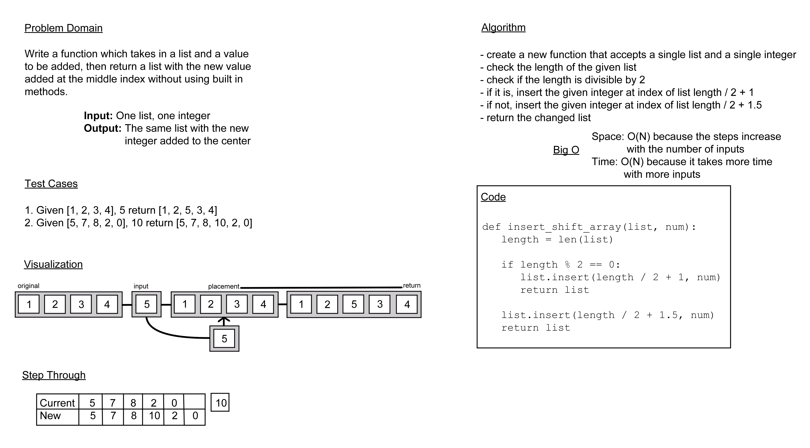

# Challenge 02: Insert a Number to the Center of a List

**Problem Domain:** Write a function which takes in a list and a value to be added, then return a list with the new value added at the middle index without using built in methods.

## Whiteboard Process

## Approach and Efficiency

For this project, I decided to find the length of the given array and use division and modulus to determine the halfway point and find where I would need to insert the value I had been given. In this case I thought that would be the best way to go about it, as it would take, as far as I can tell, the fewest amount of steps of any solutions I could imagine and would be the easiest code to understand. I believe the Big O for space and time for this is O(N), as it should have a linear relation between the input and output.
