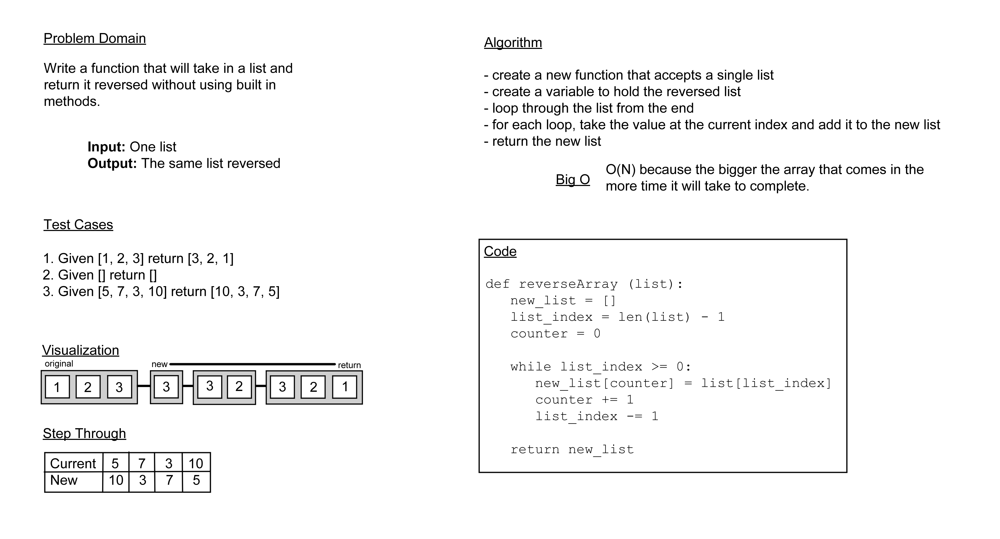

# Challenge 01: Reverse an Array

**Problem Domain:** Write a function that will take in a list and return it reversed without using built in methods.

## Whiteboard Process

## Approach and Efficiency

For this project I took a simple approach of using a loop to go through each value of the list and add them to a new list to be returned because it seemed like the simplest way to go about it barring the use of any list methods. I think the big O for this is O(N) because the only variable it has to work through is the array, but that can have any number of values within it and a bigger array will take more time for the computer to run through, but not exponentially or anything else like that.
