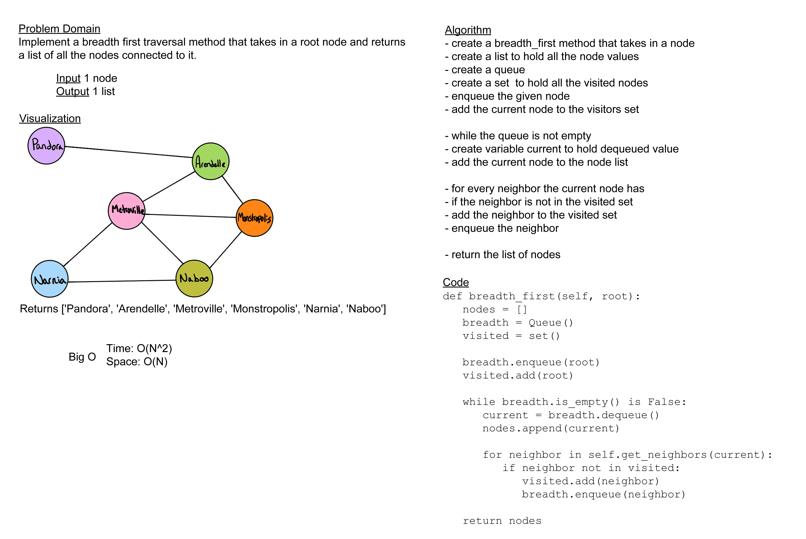

# Challenge Summary

Create a method within the Graph data structure that will implement breadth-first traversal

## Whiteboard Process

## Approach & Efficiency

The approach I took for this challenge was to use a queue to keep the correct order for breadth first traversal like with a tree, then had a list to keep track of all the nodes I passed through and a set to keep track of all the nodes I'd already hit. The complexity for the space should be O(N) because I have to create an extra list and set, but each of those is only O(N) themselves, and the time complexity would be O(N^2) because I utilize a nested loop.

## Solution

[code](../../data_structures/graph.py) |
[tests](../../tests/code_challenges/test_graph_breadth_first.py)
