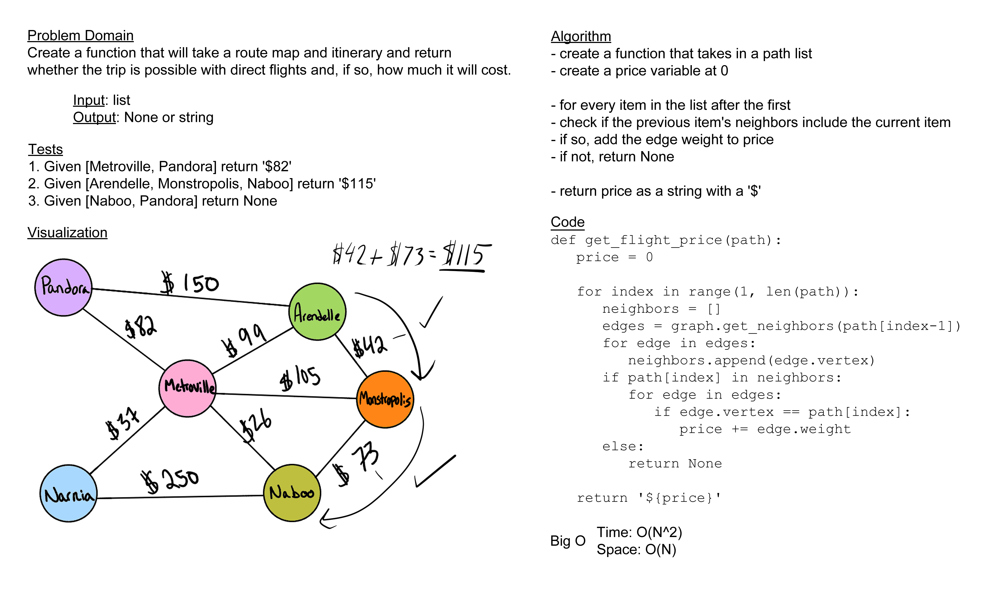

# Challenge Summary

Given a business trip itinerary, and an Alaska Airlines route map, is the trip possible with direct flights? If so, how much will the total trip cost be?

## Whiteboard Process

## Approach & Efficiency

For my approach to today's problem, I looped through the given list of destinations, checking if it was possible to get between them first and, if so, adding their price to the total. I believe the complexity for space on this solution is O(N) as the only extra space we take is for a couple of different lists. The time complexity would be O(N^2) because I have nested loops.

## Solution

[code](../../code_challenges/graph_business_trip.py) |
[tests](../../tests/code_challenges/test_graph_business_trip.py)
