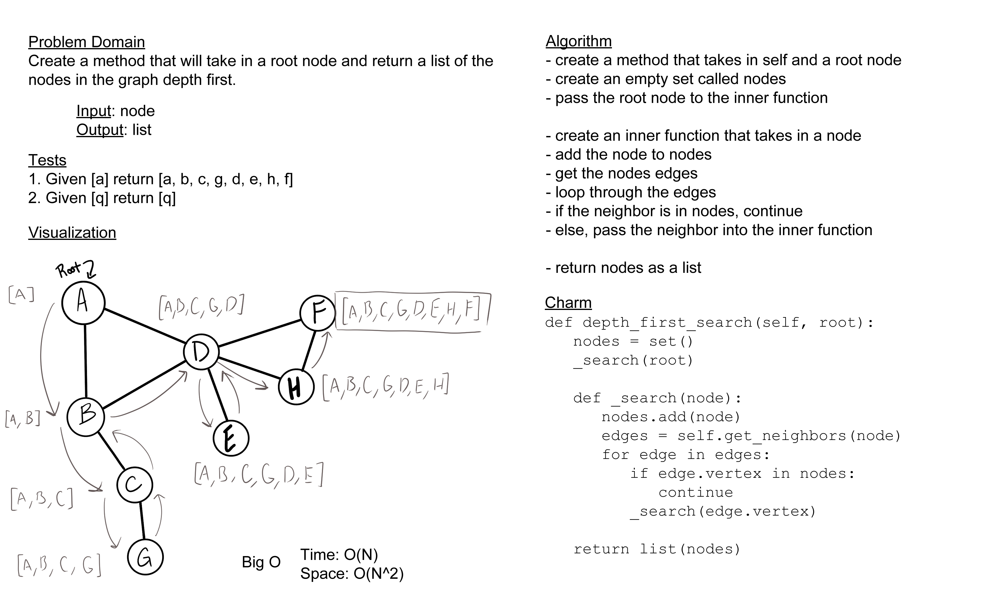

# Depth First Traversal

Conduct a depth first preorder traversal on a graph

## Whiteboard

## Approach & Efficiency

My approach for today's lab was to use recursion to traverse the graph like we have in past depth searches. The Big O of time for this I believe is O(N), as the amount of steps necessary should scale in a linear fashion with the size of the graph, and the space complexity would be O(N^2) since I am using recursive functions on the call stack.

## Solution

[code](../../data_structures/graph.py) |
[tests](../../tests/code_challenges/test_graph_depth_first.py)
