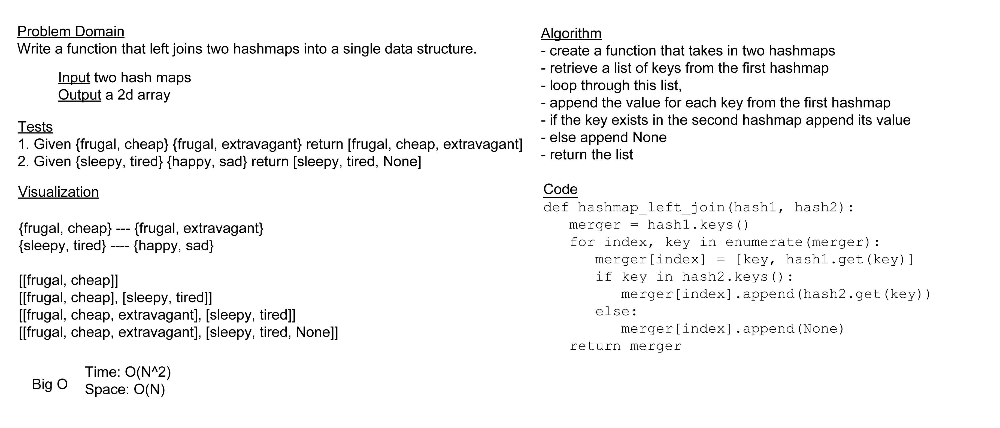

# Hashmap LEFT JOIN

Create a function that joins two hashmaps using the keys from the first map and returns them as a separate data structure.

## Whiteboard

## Approach & Efficiecny

For today's challenge I took the approach of getting all the keys from the left map and adding them and their values to a list, then appending the value for each of them or None from the second map. The complexity for this should be O(N) for space, as the only extra space it requires is for the list it will be returning, and O(N^2) for time, since it will need to run through the hash map a couple of times for each item that comes in in the first map.

## Solution

[code](../../code_challenges/hashtable_left_join.py) |
[tests](../../tests/code_challenges/test_hashtable_left_join.py)
