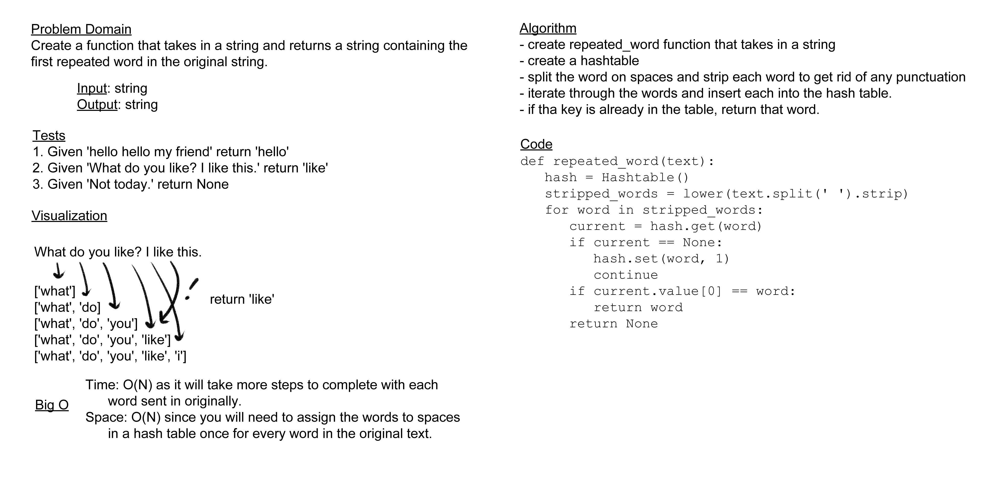

# Challenge Summary

Write a function called repeated_word that finds the first word that occurs more than once in a string.

## Whiteboard Process

## Approach & Efficiency

For my approach to this challenge, I stripped every word in the string and put them into an interable form, then I went through and checked whether each word was contained in the hashtable, inserting them if they weren't. Once I found a repeated value, I returned it. The efficiency for this function is O(N) for space and time, since it will take an amount of steps that raises in a linear fashion with the amount of words passed in, and you will have to possibly add one value to the hash table for every word.

## Solution

[code](../../code_challenges/hashtable_repeated_word.py) |
[tests](../../tests/code_challenges/test_hashtable_repeated_word.py)
