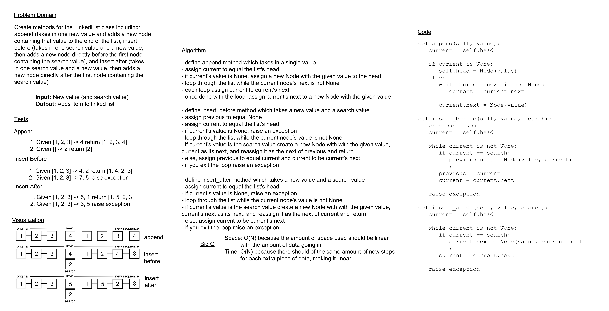

# Linked List Insertions

Create methods that will be able to insert nodes at the end of a linked list as well as before and after
specified values.

## Whiteboard Process

## Approach & Efficiency

The approach I took for this was to work off of what I knew for regular insertions and just use that at
different points found by looping through the list. The Big O for space and time in this should be O(N)
because the number of steps per item is iterative, and it will only change based on how much data is being
processed.

## Solution

<!-- Show how to run your code, and examples of it in action -->
