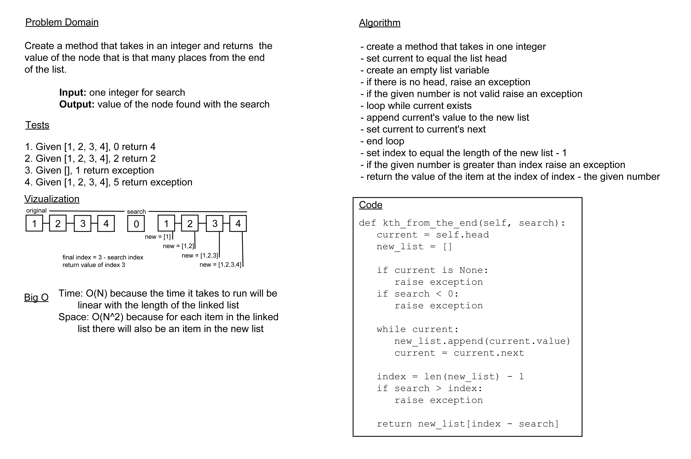

# Challenge Summary

Create a method that takes in an integer and returns the value that is that number away from the end of a linked list.

## Whiteboard Process

## Approach and Efficiency

For this challenge, I went with the method that made the most sense to me, traversing the linked list to find out how
long it is while saving each of the values so I don't need to run through a second time to reach the necessary index.
The Big O of time for this should be O(N) since the time it will take to run is dependent on how long the linked list is
and space should be O(2N) since the space taken will be whatever the linked list is twice and now that I'm thinking
about it what I put on my whiteboard was wrong. It's not squared, that would be if there was another list for each item
in the list.

Thinking further on that as well, IIRC it was mentioned to drop one value in one of the videos we watched and
technically the space is still scaling in a straight line based on how much we put in so... it may still be O(N).

## Solution

[code](../../data_structures/linked_list.py) ||
[tests](../../tests/code_challenges/test_linked_list_kth.py)
