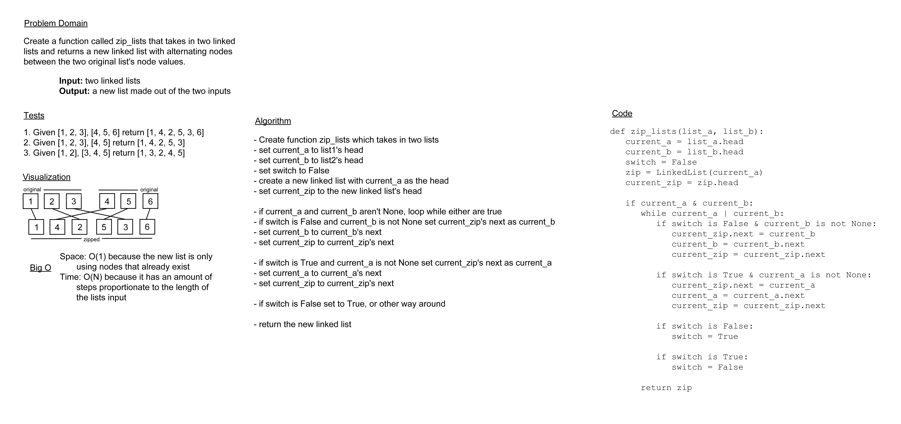

# Challenge Summary

Today's challenge was to create a function that would take in two linked lists and return a new linked list combining
the two with their nodes alternating.

## Whiteboard Process

## Approach & Efficiency

My original approach to this was to assign the nodes themselves to the new list so as not to need to allocate any new
data and achieve O(1) for space, but I realized the way I was going about it was getting rid of the links to the rest
of each list, so after a few hours of fighting with it I settled for an O(N) solution in space and time with just
creating new nodes based on the values of each of the lists.

## Solution

[code](../../code_challenges/linked_list_zip.py) ||
[tests](../../tests/code_challenges/test_linked_list_zip.py)
