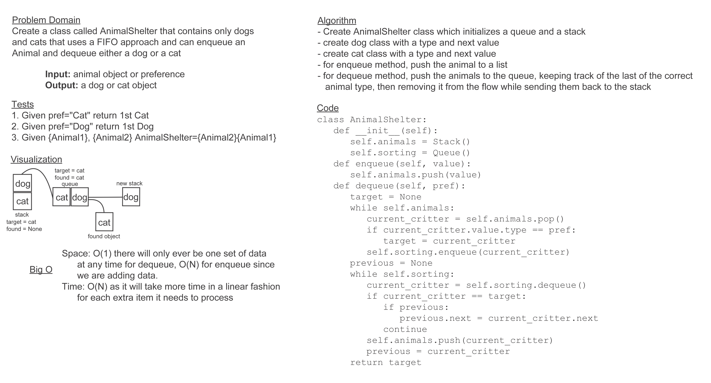

# Challenge Summary

Create a class designated AnimalShelter that returns animals on a FIFO basis according to the species preference of the
user.

## Whiteboard Process

## Approach & Efficiency

My approach for this challenge was to utilize a stack for animal storage, then to run them through a queue to check
their values and back into a stack when I'd removed the necessary animal. The efficiency for this is O(1) for space and
O(N) for time. Since I'm only ever using one data storage structure at a time and moving values between them, the amount
of memory usage doesn't change during dequeue, but the number of steps does increase depending on how many animals are
in the shelter.

## Solution

[code](../../code_challenges/stack_queue_animal_shelter.py) |
[tests](../../tests/code_challenges/test_stack_queue_animal_shelter.py)
