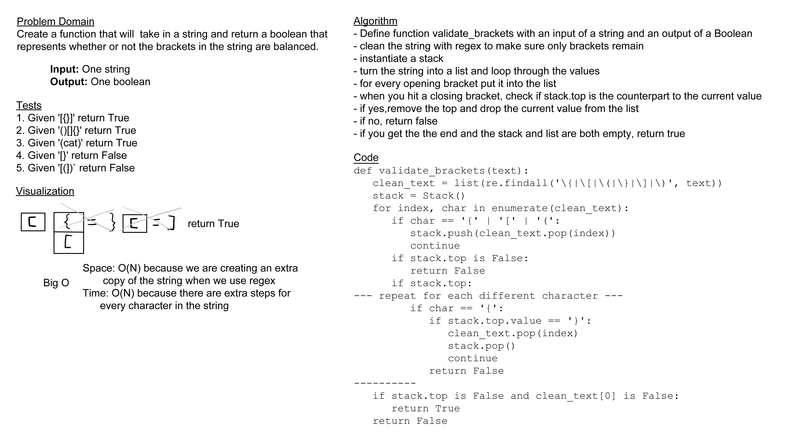

# Challenge Summary

Today's challenge was to create a function that would take a given string and return whether or not it was balanced in
terms of bracket placing.

## Whiteboard Process

## Approach & Efficiency

For my approach, I used a regular expression to ensure that any non-bracket characters had been removed from the string,
then looped through a list created from the string, pushing each opening bracket to a stack and checking each closing
bracket against the top of the stack to see if they were a matching pair, then removing them from the equation if they
were. I believe the efficiency for both aspects of this are O(N) because the amount of memory taken and the amount of
steps needed to complete this will both increase in a linear fashion with whatever is passed in.

## Solution

[code](../../code_challenges/stack_queue_brackets.py) |
[tests](../../tests/code_challenges/test_stack_queue_brackets.py)
