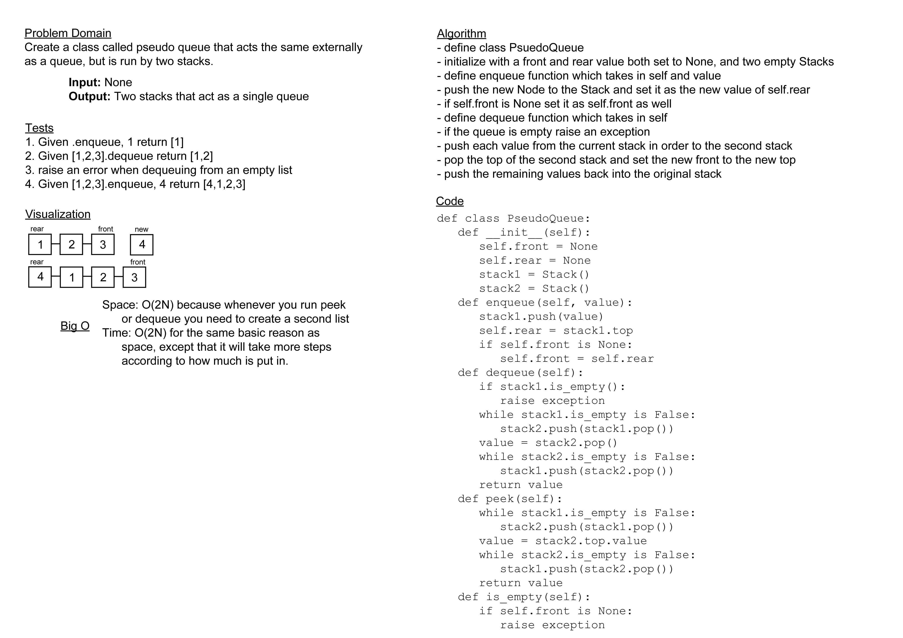

# Challenge Summary

Today's challenge was to create a class that acted exactly as a queue would externally, but behind the scenes was being
run by two stacks.

## Whiteboard Process

## Approach & Efficiency

For this, I thought the best approach would be to have one stack that was the main part of the structure, then whenever
I hit anything that needed the front value I just dumped that entire stack upside down into a second stack and grabbed
it's top. I believe this is the most efficient method for both time and space, as both should only be O(N) ~~ignore me
saying it is O(2N) on my whiteboard one of these days I will get it right~~ as the amount of data being passed into the
stack is the only space that will be taken and the steps only increase with the amount of data in the stack.

## Solution

[code](../../code_challenges/stack_queue_pseudo.py) |
[tests](../../tests/code_challenges/test_stack_queue_pseudo.py)
