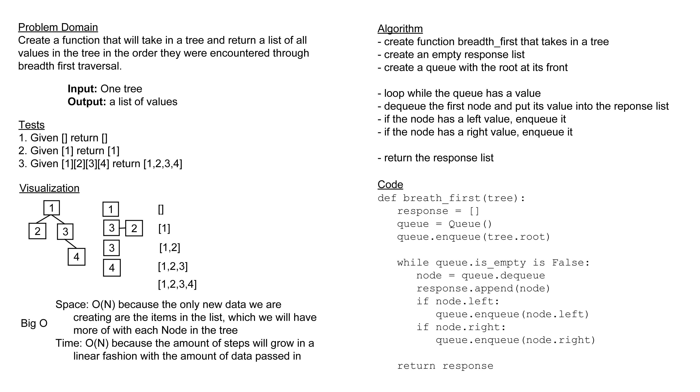

# Challenge Summary

Create a function that will take in a tree and return a list of all values in the tree in the order they were
encountered through breadth first traversal.

## Whiteboard Process

## Approach & Efficiency

For this challenge, I took the approach of sending each node through a queue as I hit it to ensure I got each level done
in order all the way across while also keeping the next level of nodes in line. The efficiency in time on this is O(N)
because there are more steps with each extra node on the tree, and space is also O(N) because we are only creating more
data in adding values to the list and nowhere else.

## Solution

[code](../../code_challenges/tree_breadth_first.py) |
[tests](../../tests/code_challenges/test_tree_breadth_first.py)
