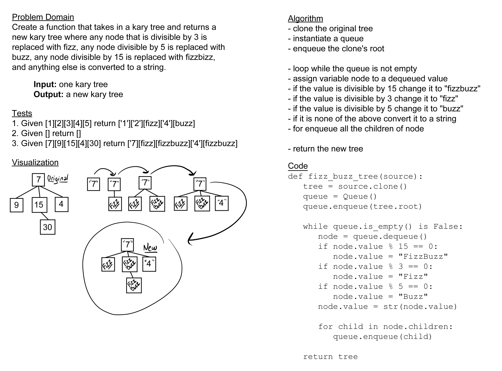

# Challenge Summary

Create a function that takes in a kary tree and returns a new kary tree where any node that is divisible by 3 is
replaced with fizz, any node divisible by 5 is replaced with buzz, any node divisible by 15 is replaced with fizzbuzz,
and anything else is converted to a string.

## Whiteboard Process

## Approach & Efficiency

The approach I took for this was to create a clone of the original tree and check through each node using breadth
first searching, either changing the value to be a string or making it into fizz buzz or fizzbuzz if it was divisible
by 3 and or 5. The efficiency for this is probably O(N) for space, since it creates a second tree, and O(N) for time
because it has to search through every node in the tree and do something each time, but it is not recursive like some
other search functions.

## Solution

[code](../../code_challenges/tree_fizz_buzz.py) |
[tests](../../tests/code_challenges/test_tree_fizz_buzz.py)
