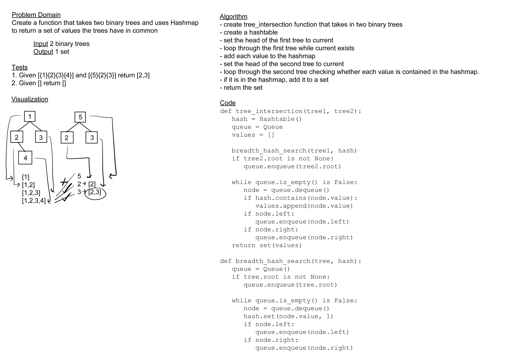

# Challenge Summary

Create a function that takes in two binary trees and returns a set of all common values between them.

## Whiteboard Process

## Approach & Efficiency

## Solution

[code](../../code_challenges/tree_intersection.py) |
[tests](../../tests/code_challenges/test_tree_intersection.py)
